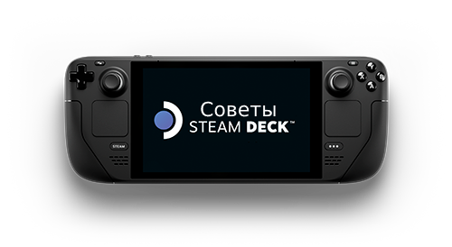

<h1 align="center">Сборник инструкций и решений проблем Steam Deck</h1> 
<p2 align="center"></p>

## Что это
### ``` Сборник пополняемых инструкций и полезностей для Steam Deck, гайды по решению возникающих проблем в запускаемых играх и работе устройства ```

## Рекомендуемые ссылки
- ### https://t.me/steamdeck_oc_chat 
``` Заходите в телеграмм форум, все основное общение тут ```

- ### https://vk.com/@steamdeck_oc-guide 
```Общий гайд по Steam Deck. Внутри про мелкие советы, настройку полезных плагинов, уменьшение износа SSD, увеличение производительности (без влияния на батарею) ```

- ### [4PDA](https://4pda.to/forum/index.php?showtopic=1028788) 
``` Обсуждение, покупка, моддинг и многое другое ```

- ### https://sharedeck.games/
``` Подборка\поиск наилучших настроек производительности для игр ```

- ### https://www.protondb.com/ 
``` Настройки от пользователей для запуска различных игр под Proton, в т.ч не поддерживаемых официально ```


